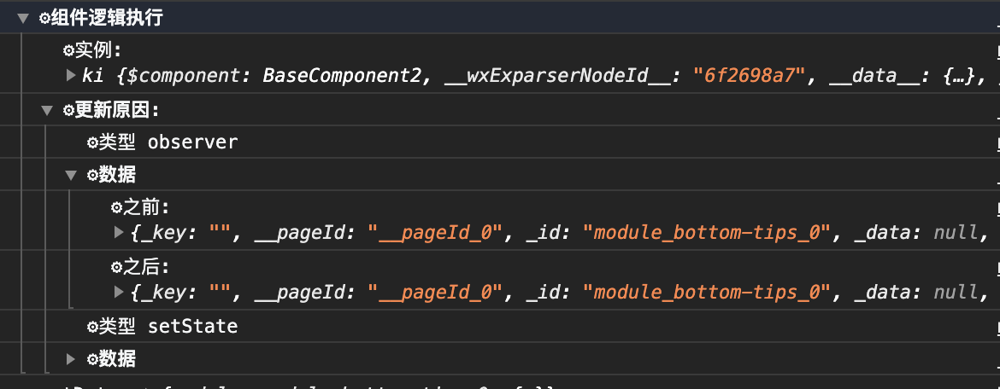

## 提前返回

[原文](https://tkdodo.eu/blog/component-composition-is-great-btw)

- JSX 中只能编写表达式，不能编写语句

```JSX
// 其中的条件很容易被遗漏，尤其对 data 的判断
export function ShoppingList() {
  const { data, isPending } = useQuery(/* ... */)

  return (
    <Card>
      <CardHeading>Welcome 👋</CardHeading>
      <CardContent>
        {data?.assignee ? <UserInfo {...data.assignee} /> : null}
        {isPending ? <Skeleton /> : null}
        {!data && !isPending ? <EmptyScreen /> : null}
        {data
          ? data.content.map((item) => (
              <ShoppingItem key={item.id} {...item} />
            ))
          : null}
      </CardContent>
    </Card>
  )
}
```

```JSX
// 抽离出 Layout 但对于条件并没有得到更好的处理
function Layout(props: { children: ReactNode }) {
  return (
    <Card>
      <CardHeading>Welcome 👋</CardHeading>
      <CardContent>{props.children}</CardContent>
    </Card>
  )
}

export function ShoppingList() {
  const { data, isPending } = useQuery(/* ... */)

  return (
    <Layout>
      {data?.assignee ? <UserInfo {...data.assignee} /> : null}
      {isPending ? <Skeleton /> : null}
      {!data && !isPending ? <EmptyScreen /> : null}
      {data
        ? data.content.map((item) => (
            <ShoppingItem key={item.id} {...item} />
          ))
        : null}
    </Layout>
  )
}
```

```JSX
// 提前返回使得条件更清晰，Layout 使得这部分重复内容更好的被复用
function Layout(props: { children: ReactNode }) {
  return (
    <Card>
      <CardHeading>Welcome 👋</CardHeading>
      <CardContent>{props.children}</CardContent>
    </Card>
  )
}

export function ShoppingList() {
  const { data, isPending } = useQuery(/* ... */)

  if (isPending) {
    return (
      <Layout>
        <Skeleton />
      </Layout>
    )
  }

  if (!data) {
    return (
      <Layout>
        <EmptyScreen />
      </Layout>
    )
  }

  return (
    <Layout>
      {data.assignee ? <UserInfo {...data.assignee} /> : null}
      {data.content.map((item) => (
        <ShoppingItem key={item.id} {...item} />
      ))}
    </Layout>
  )
}
```

## console.group

`console.group`可以在一些场景更好的在控制台上进行输出

可以理解成:

- `console.group(label)`创建一个分组（控制台显示为缩进和折叠）
- 其中的`console.log`为折叠内的输出
- `console.groupEnd()`结束这个分组

```javascript
const messages = ComponentMessage.get(component) || []
ComponentMessage.set(component, [])

console.group('⚙️组件逻辑执行')
console.log('⚙️实例:', component.$scope)
console.group('⚙️更新原因:')
messages.forEach(message => {
  console.log('⚙️类型', message.type)
  if (message.content) {
    console.group('⚙️数据')
    console.log('⚙️之前:', message.content.pre)
    console.log('⚙️之后:', message.content.next)
    console.groupEnd()
  }
})
console.groupEnd()
console.groupEnd()
```


